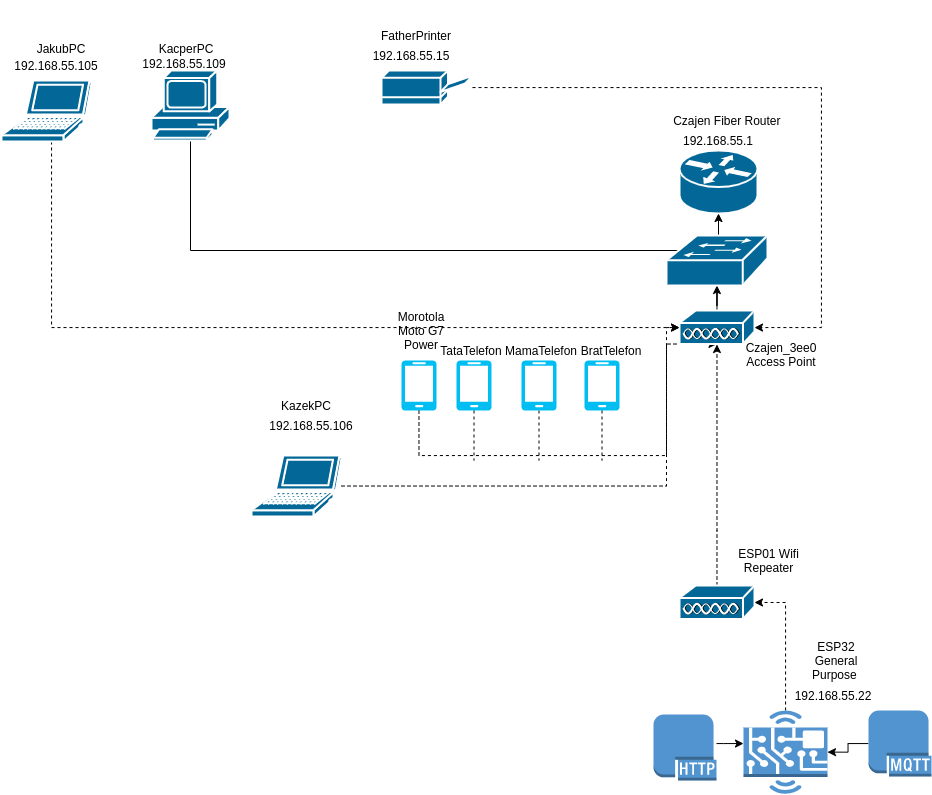

## System operacyjny w środowisku sieciowym

### Zadania


1. Z wykorzystaniem maszyny wirtualnej, zainstaluj SO oraz wypisz parametry konfiguracji IP tj:
   * Adres 10.0.2.15
   * Maska 255.255.255.0
   * Adres bramy 10.0.2.2
   * DNS 1 10.10.4.204
   * DNS 2 1.1.1.1
    
    Powyższe parametry uzyskaj na wszystkich z wymienionych systemów

   * [Linux Alpine](https://alpinelinux.org/)
   * [Linux Debian](https://www.debian.org/)
   * [Linux CentOS](https://www.centos.org/)
   * Windows 

2. Sprawdź oraz przygotuj charakterystykę dla przykładowego urządzenia w Twojej sieci domowej
   * Adres 192.168.55.22
   * Maska 255.255.255.0/24
   * Adres bramy 192.168.55.1
   * DNS 1 8.8.8.8
   * DNS 2 8.8.4.4
  
    Przygotuj dokumentację graficzną Twojej sieci domowej, uwzględnij adresy i urządzenia

3. Zarejestruj konto w CISCO Academy celem pobrania Packet tracer 
   https://www.netacad.com/courses/packet-tracer

4. Dlaczego umiejętnosci z zakresu sieci komputerowych mogą mi się przydać? :)


### Charakterystyka systemu operacyjnego

| Charakterystyka           | wartość               | komentarzu                |
| -------------             |:-------------:        | -----:                    |
| nazwa                     | linux                 | centos 7                  |
| cfg interfejsów           | centos 7 | /etc/sysconfig/network-scripts         |
| program (parametry sieci) | niewiem               |                           |
| ....                      | .....                 |                           |
| nazwa                     | Alpine Linux          |                           |
| Konfiguracja ip           | ``$ ip all ``         | show all eth interfaces   | 
| Tablica routingu          | ``$ ip route show ``  | what is gateway?!         | 
| check nameservers (DNS)   | ``$ cat /etc/resolv.conf ``  | which DNS were set | 

### Konfiguracja połączenia sieciowego

| Parametr | wartość           | komentarzu |
| ------------- |:-------------:| -----:|
| Adres IP      | 10.0.2.15        | przydzielony przez DHCP |
| Maska podsieci| 10.0.2.15/**24** | **255.255.255.0**    |
| Brama         | 10.0.2.2         | default from route table |
| DNS 1         | 10.10.4.204      | cat /etc/resolv.conf     |
| DNS 2         | 1.1.1.1          | nslookup uek.krakow.pl   |

### Schemat sieci

aby załączyć obrazek 

```markdown


```



