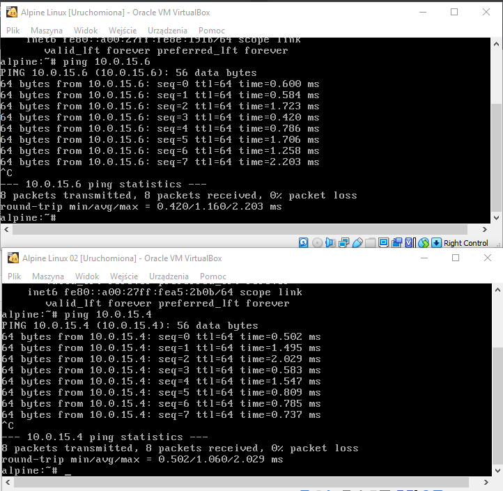
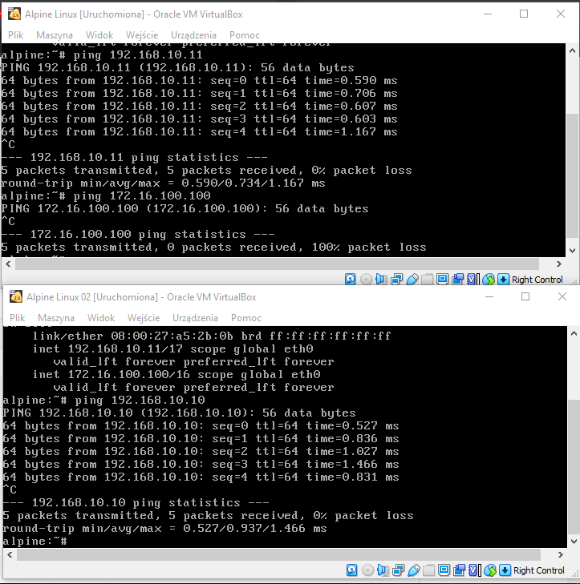
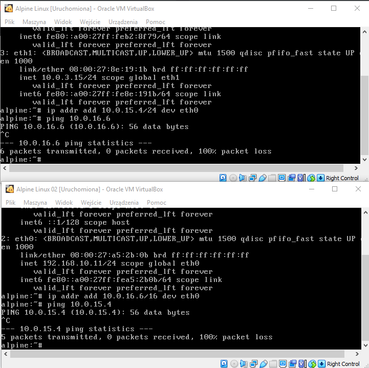

## Ustawianie parametrów sieci

### Zadania

0. Z wykorzystaniem dowolnych systemów operacyjnych na których potrafisz uruchomić interpreter ``python`` oraz oprogramowania virtualbox odwzoruj poniższy schemat sieci:

![alt text][network]

[network]: ./network.png "Logo Title Text 2"

1. na 1 z komputerów zainstaluj i uruchom program ``server.py`` dostępne pod adresem ``https://github.com/jkanclerz/client-server-chat``
2. na 2 z komputerów zainstaluj i uruchom program ``client.py`` dostępne pod adresem ``https://github.com/jkanclerz/client-server-chat``
3. Manipulując konfiguracją sieci na poziomie virtualbox, uruchom serwer czatu, oraz udostępnij go na wybranym porcie oraz adresie tak aby istniała możliwość połączenia przez inne osoby w obrębie pracowni
4. Zainstaluj oprogramowanie serwera HTTP ``nginx`` lub innego, skonfiguruj plik index.html wg instrukcji, sprawdź dostępność strony z wykorzystaniem dowolnego klienta protokołu ``HTTP`` z różnych konfiguracji IP
5. Posługując się programami tj: ``netstat`` lub ``lsof`` sprawdź na jakich portach zostały uruchomione serwery czatu czy HTTP

apk add git/python3/nginx/itp

rc-service networking restart

/etc/nginx/conf.d/default.conf 

rc-service nginx restart

/var/www

curl adres -L

ip addr flush eth0

Wejściowe parametry sieci
-------------------------
| Parametr | wartość | komentarz(opcionalny) |
| ------------- |:-------------:| -----:|
|   PC 1 |  
| IP - address  | 10.0.15.4 |ip addr add 10.0.15.4 dev eth0 |
| MASKA  | /24 (255.255.255.0) | |
|   |  | |
| PC 2  |  | |
| IP - address  | 10.0.15.6 | ip addr del 10.0.15.6 dev eth0 |
| MASKA  | /24 (255.255.255.0 )| |

Weryfikacja połączenia

Polecenie
```
PC1: ping 10.0.15.6
PC2: ping 10.0.15.4
```

Efekt - działa




Statyczna konfiguracja parametrów połączenia
Wejściowe parametry sieci
-------------------------
| Parametr | wartość | komentarz(opcionalny) |
| ------------- |:-------------:| -----:|
|   PC 1 |  
| IP - address  | 192.168.10.10 | |
| MASKA  | 255.255.255.0 |/24 |
|   |  | |
| PC 2  |  | |
| IP - address  | 192.168.10.11 | |
| MASKA  | 255.255.128.0 |/17 |
| PC 2  |  | |
| IP - address  | 172.16.100.100 | |
| MASKA  | 255.255.0.0 |/16 |

Weryfikacja połączenia

Polecenie
```
PC1: ping 192.168.10.11
PC1: ping 172.16.100.100
PC2: ping 192.168.10.10
```

Efekt - na 172... nie działa




Nowa statyczna konfiguracja 

-------------------------
| Parametr | wartość | komentarz(opcionalny) |
| ------------- |:-------------:| -----:|
|   PC 1 |  
| IP - address  | 10.0.15.4 | |
| MASKA  | 255.255.255.0 |/24 |
|   |  | |
| PC 2  |  | |
| IP - address  | 10.0.16.6 | |
| MASKA  | 255.255.0.0 |/16 |

Weryfikacja połączenia

Polecenie
```
PC1: ping 10.0.16.6
PC2: ping 10.0.15.4
```

Efekt - nie działa




### Utrwalenie konfiguracji

Dlaczego? Jak? Co? :)

/etc/network/interfaces

auto eth0

iface eth0 inet static(dhcp)

    address 192.168.10.11
    
    netmask 255.255.255.0
    
    hostname localhost

### Warto wiedzieć

-------------------------
| Parametr | wartość | komentarz(opcionalny) |
| ------------- |:-------------:| -----:|
| Lokalizacja pliku z konfiguracją sieci|/etc/network/interfaces | |
| UP -> Wyłączenie interfejsu sieciowego|ip link set up eth1 | |
| DOWN -> Włączenie interfejsu sieciowego|ip link set down eth1| |
| Sprawdzenie obecnych parametrów |ip addr show | |
| lista wszystkich interfejsów |netstat |-t(tcp) -u(udp) -p(PID) -n(zmienia porty na nazwy) |
| Które interfejsy jakie porty słuchają |netstat -l | |

