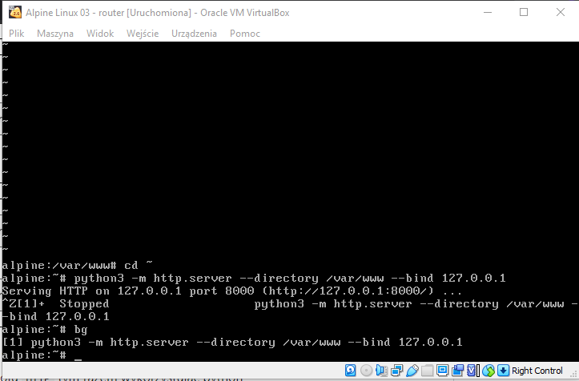

## Zarządzanie interfejsami z wykorzystamiem programu IP

* stan interfejsu
    * interfejs up - ip link set up eth1
    * interfejs down - ip link set down eth1
* adresacja
    * dodaj adres - ip addr add 192.168.200.100 dev eth0
    * zmień adres - usunąć i dodać na nowo ;) 
    * usuń adres - ip addr del 192.168.200.100 dev eth0
    * wyczyść adresy - ip addr flush eth0
* routing
    * pobierz trasę dla adresu - ip route get adres
    
* adresacja fizyczna
    * pokaż adresy interfejsów dostępnych w sieci - ip addr
    * pokaż adresy dla konkretnego interfejsu - ip addr show eth0
     

### ip 

| subcommand    |  polecenie   | opis  |
| ------------- |:-------------| :---------------| 
|   ``addr``    |                               | infirmacje o adresacji i własnościach interfejsów |
|               |   ``ip addr``                 | informacja o wszystkich interfejsach              |
|               |   ``ip addr show dev enp0s3`` | informacja o konkretnym interfejsie               |
|   ``link``    |``ip lint set up/down eth0``  | włącza/wyłącza interfejs |
|   ``route``   |``ip route`` |routing |
|   ``maddr``   | ``ip maddr`` |tak samo jak addr tylko obsługuje złożone adresy |
|   ``neigh``   | ``ip neight`` |pokazuje tablice ARP/sasiadow |
|   ``help``    |``ip addr help``|wyświetla dostępne opcje |

### Zadanie

1.
   * Przygotuj konfigurację sieci zgodnie z powyższym diagramem, 
   * Przetestuj połączenie poleceniem ping
   * Przetestuj połączenie z internetem
   * Sprawdź trasę dla połączeń z adresem IP z poza Twojej sieci lokalnej np. 1.1.1.1
   
   

1.1
   * Zmodyfikuj połączenia sieciowe zgodnie z poniższym schematem
   * Ponownie sprawdź trasę dla adresu z poza Twojej sieci lokalnej
  
  
  

2.
   * Zainstaluj na komputerze ``PC0`` serwer ``HTTP`` np. ``nginx`` 
   * skonfiguruj program ``nginx`` tak aby wyświetlał zawartość katalogu ``/var/www``
   
   
   
   * przeładuj konfigurację
   * utwórz własny plik ``index.html`` zawierający tekst
   * Przetestuj komunikację z ``localhost``  wykorzystując konsolowego klienta ``HTTP``, program ``curl``
   
   
   
3.
   * Sprawdź który port został zarezerwowany dla komunikacji przez progrmam ``nginx`` - 80
   * np. program ``netstat``
   
   

4.
   * Przetestuj komunikację z serwerem HTTP z poziomu komputera ``PC2``
   * czy jest dostepne polecenie curl?
   * np. ``curl {adres_ip_pc_2}``
   * Wykonaj test dla połączenia na innym porcie niż ``80``, np ``curl {adres_ip_pc_2}:8080``
   * czy odpowiedź jest analogiczna jak dla testu z zadania ``2``?

   

5.
   * Rozbuduj sieć o kolejny komputer ``PC3`` zgodnie z diagramem
   

6. 
   * Na komputerze ``PC3`` utwórzy plik index.html w katalogu ``/var/www``
   * Na komputerze ``PC3`` uruchom serwer protokołu ``HTTP`` tym razem wykorzystujac python
   * ``python3 -m http.server --directory /var/www --bind 127.0.0.1``
   * Przenieś wykonanie programu do tła ``ctrl + z`` ``bg``
   
   
   
   * Sprawdź połączenie wykorzystując ``curl localhost:port``
   * Sprawdź połączenie wykorzystując ``curl adres_ip:port``
   * Sprawdź zarezerwowane porty korzystając z polecenia ``netstat``
   
   
   
7. 
    * Na komputerze ``PC3`` zmodyfikuj sposób uruchamiania serwera http w taki sposób aby możliwe było wyświetlenie strony z komputerów ``PC1`` oraz ``PC2`` 
    * Przeprowadź test takiej komunikacji
    
    PC1:
    
    
    PC2:
    

8.
   * Na komputerze ``PC0`` zainstaluj i uruchom w tle program ``chat-server`` z cwiczeń 2
   * Sprawdź zarezerwowane porty korzystając z polecenia ``netstat``
   
   
   
   * Na komputerach ``PC1`` oraz ``PC2`` zainstaluj program ``chat-client``
   * Połącz się z serwerem dostępnym pod adresem IP ``PC0``
   
   
