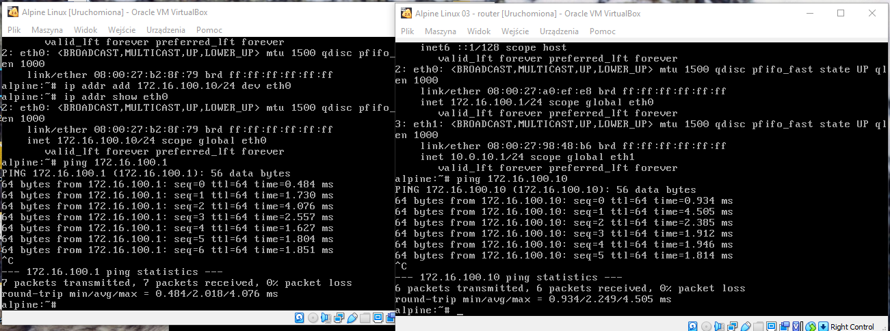
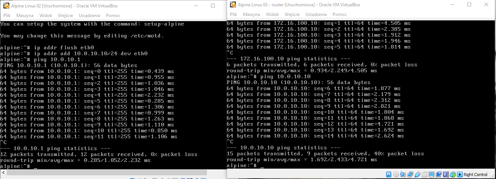
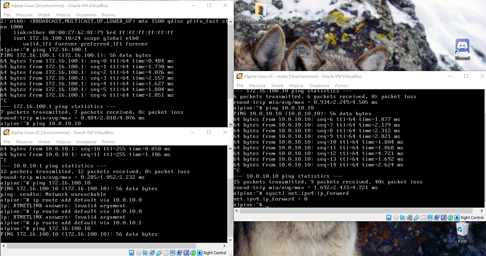
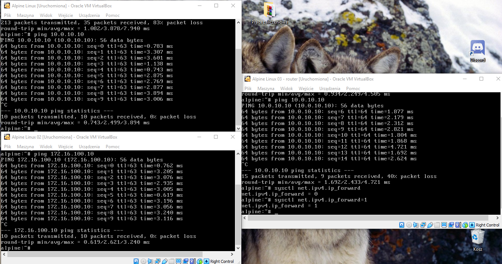
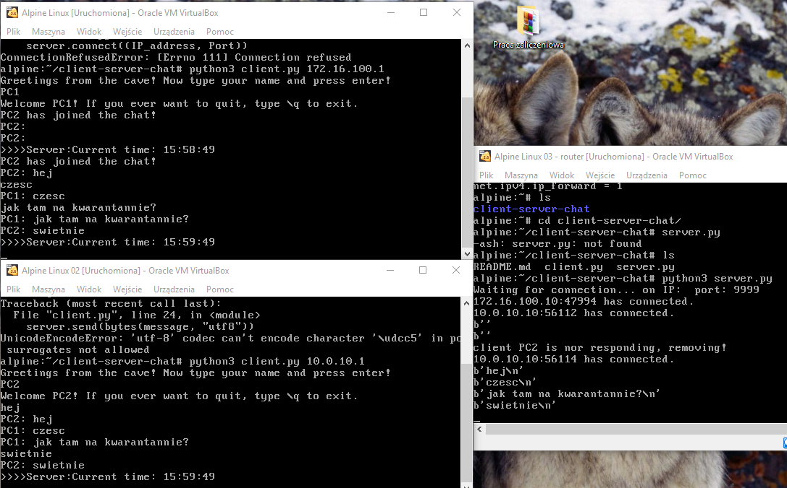
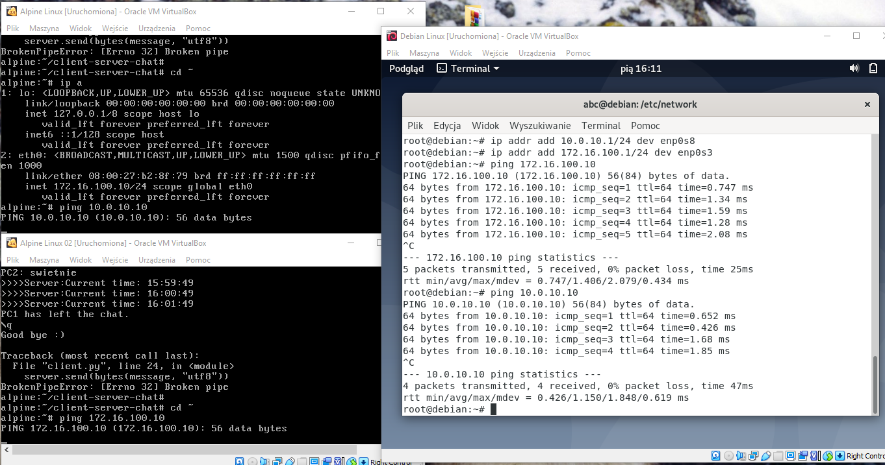
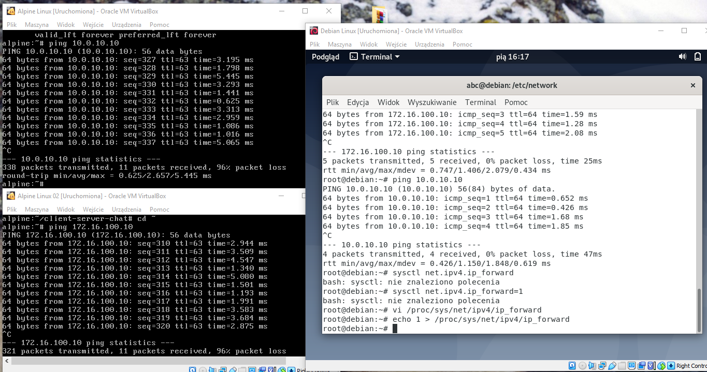
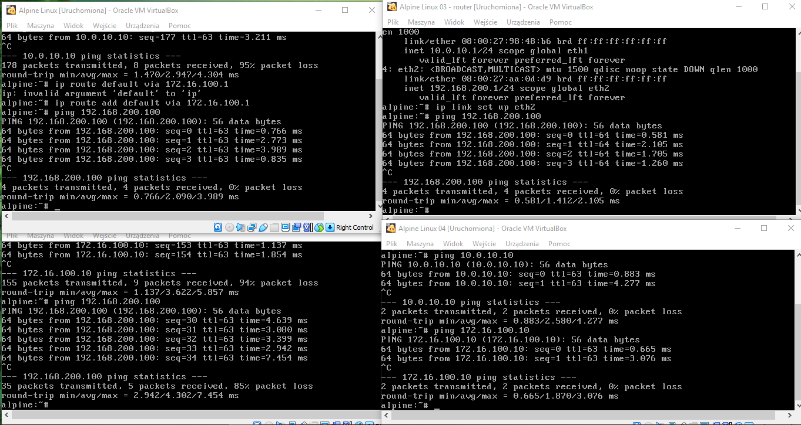
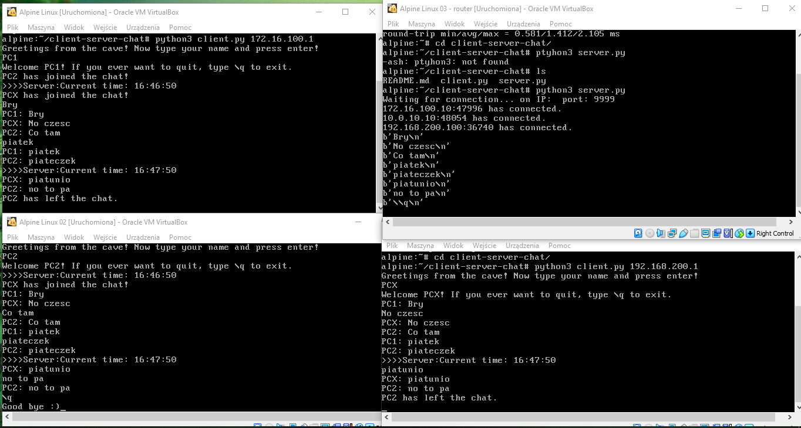

## Konfiguracja route

* routing
    * dodaj trasę default - ip route add default via 172.16.100.1
    * dodaj trasę przez bramę - ip route add 10.0.10.0/24 via 172.16.100.1
    * dodaj trasę przez interfejs - ip route add default via 172.16.100.0
    * usuń trasę - ip route del default via 172.16.100.1
    * zmień trasę - ip route replace/add via 172.16.100.1 dev eth0
    * pobierz trasę dla adresu - ip route get adres
     
### ip 
| subcommand    |  polecenie   | opis  |
| ------------- |:-------------| :---------------| 
|   ``route``    |                               | |
|               |   ``ip route add``             | |

### Zastosowania

* Wydzielenie osobnej sieci dla urządzeń sieciowych
* Separacja urządzeń gościnnej sieci WIFI do osobnej sieci
* Zapewnienie komunikacji pomiędzy odrębnymi sieciami lokalnymi z wykorzystaniem VPN

### Zadanie

1.
   * Przygotuj konfigurację sieci zgodnie z powyższym diagramem, 
   * Przetestuj połączenie pomiędzy wszystkimi elementami sieci
   * Dlaczego połączenie może nie działać - bo w pliku /proc/sys/net/ipv4/ip_forward musi być wpisana wartość 1
   
   KOMUNIKACJA PC1<->ROUTER
  
   KOMUNIKACJA PC2<->ROUTER
 
   KOMUNIKACJA PC1<->PC2
 
 
 
2. Przygotuj konfigurację tak aby została załadowana poprawnie po ponownym uruchomieniu systemu
   * Patrz ``utrwalanie statycznej konfiguracji cwiczenia 2``
   * zwróć uwagę na różnice pomiędzy dydtrybucjami systemu
3. Zainstaluj, uruchom i przetestuj działanie aplikacji ``chat``
   * aplikacja dostępna w serwisie github ``https://github.com/jkanclerz/client-server-chat`` lub preinstalowana na maszynie dostępnej w zasobach kursu
   

### Zadanie do domu

1. Przygotuj konfigurację z zadania 1 wykorzystując inny system operacyjny na komputerze pełniącym rolę routera.
  * debian / centos / inny
  * zapewnij poprawną komunikację pomiędzy PC3 -> PC1
  
  
  
  
2. Dodaj kolejną sieć do komputera pełniącego funkcję routera
   * Sprawdź poprawność komunikacji pomiędzy innymi obszarami sieci
   
   
   
   * Zweryfikuj działanie programu chat pomiędzy różnymi segmentami sieci
   
   

