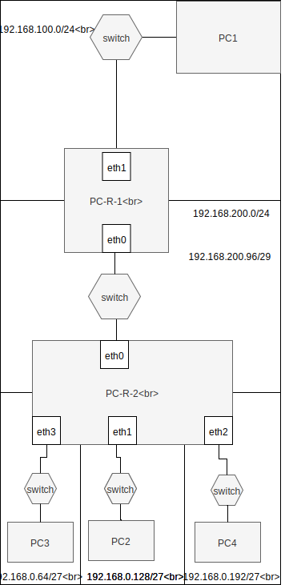
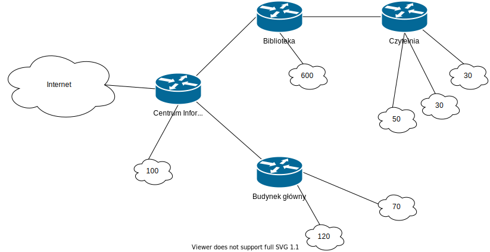

Podsieci i nadsieci IP
----------------------

adresacja
-----------------------------------------------------
| PC     |  interfejs   | adres  |
| --------- |:-------------| :---------------| 
| ``PC1``   | enp0s3 |      |
| ``PC-R-1``| enp0s3 |     |
| ``PC-R-1``| enp0s8 |      |
| ``PC-R-2``| enp0s3 |       |
| ``PC-R-2``| enp0s8  |       |
| ``PC-R-2``| enp0s9  |     |
| ``PC-R-2``| enp0s10 |      |
| ``PC2``   | enp0s3  |     |

routing
-------

| destination | trasa | interfejs  |
| --------- |:-------------| :---------------| 
| ``PC1``     |  | |
| ``default`` |  | enp0s3 ```` |
| ``PC-R-1``  |  |        |
| ```` |  | enp0s3 |
| ```` |  | enp0s8 |
| mozna dzielic   |  |  |
| ````  |  | enp0s8  |
| ```` |  | enp0s8  ```` |
| ```` |  | enp0s8 ```` |
| lub za 1 iteracją   |  |  |
| ````   |  | enp0s8 ````|
| ``PC-R-2``  |  |        |
| ```` |  | enp0s3 |
| ```` |  | enp0s3 ```` |
| ````  |   | enp0s8 |
| ```` |  | enp0s9 |
| ```` |  | enp0s10 |


Zadanie
------------



1. Wykorzystując program DIA lub draw IO ikony CISCO
  * Przygotuj diagram powyższej sieci uwzględniając urządzenia tj:
    * ROUTER
    * SWITCH
    * PC
  * Uzupełnij diagram o adresację sieci oraz poszczególnych urządzeń
  
2.
   * Przygotuj konfigurację sieci zgodnie z powyższym diagramem
   * W pierwszej kolejności przygotuj ``PC1``, ``PC-R-1``, ``PC-R-2``, ``PC-2``
   * Do konfiguracji wykorzystaj dane z tabeli powyżej
   * Rozszerz istniejącą konfigurację dzieląc istnijącą sieć dla ``PC2`` na 3 podsieci zgodnie z diagramem
   * Przetestuj połączenie pomiędzy wszystkimi elementami sieci ``PC1->PC2`` ``PC1->PC4``
   * Zapewnij permanentną konfigurację, dodając odpowiednie wpisy w plikach konfiguracji


Zadanie do domu
---------------
1. Przygotuj schemat powyższej sieci z wykorzystaniem programu CISCO PACKET TRACER
2. Zaproponuj adresację dla poniższego schematu
   Centrum Informatyki dysponje adresem CIDR ``149.156.48.0/22`` część z tej przestrzeni zatrzymuje na potrzeby własnych potrzeb, pozostałą część oddaje innym jednostkom

  