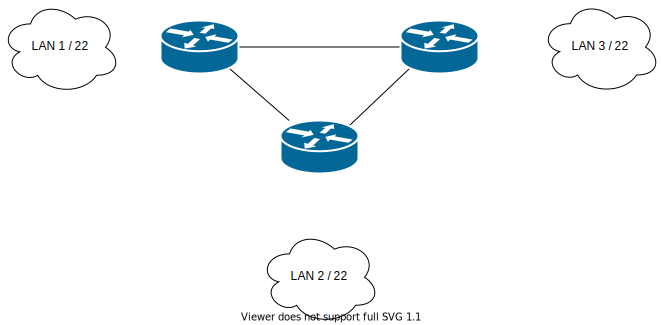

# Zadanie 1

Organizacja planuje rozpoczęcie działalności w 3 budynkach, w każdym z nich przewiduje do 1000 urządzeń IP

1. Zaprojektuj oraz udokumentuj prototyp rozwiązania z wykorzystaniem oprogramowania ``CISCO Packet Tracer``, ``VirtualBox`` lub podobnego. 

## Schemat



## Zawartość

 * Adresy poszczególnych sieci IP
 * Adresację linków pomiędzy routerami
 * Tablice routingów na poszczególnych routerach
 

### Adresacja

| Sieć  | Adres Sieci | Host min     | Host max      | Adres rozgłoszeniowy |
| -------------     |:-------------: | -----:       | -----:        | -----:    |
| 1         | 10.0.0.0/22 | 10.0.0.1 | 10.0.3.254 | 10.0.3.255  |
| 2         | 10.1.0.0/22 | 10.1.0.1| 10.1.3.254 | 10.1.3.255 |  
| 3         | 10.2.0.0/22 | 10.2.0.1| 10.2.3.254 | 10.2.3.255 |  
| 4 (Routing) | 192.168.1.0/30 | 192.168.1.1 | 192.168.1.2 | 192.168.1.3 |
| 5 (Routing) | 192.168.2.0/30 | 192.168.2.1 | 192.168.w.2 | 192.168.2.3 |
| 6 (Routing) | 192.168.3.0/30 | 192.168.3.1 | 192.168.3.2 | 192.168.3.3 |

| Router | Interface | Ip | 
| ------------- | -------------  |:-------------:|
| Router 1 | Serial 0/3/0 |   192.168.1.1/30 | 
| Router 1 | Serial 0/3/1  |   192.168.3.2/30 | 
| Router 1 | FastEthernet 0/0  |  10.0.0.1/22 | 

| Router | Interface | Ip | 
| ------------- | -------------  |:-------------:|
|  Router 2 |  Serial 0/3/0  |  192.168.2.1 | 
|  Router 2 | Serial 0/3/1  |  192.168.1.2/30 | 
|  Router 2 | FastEthernet 0/0  |  10.1.0.1/22 | 

| Router | Interface | Ip | 
| ------------- | -------------  |:-------------:|
|  Router 3 | Serial 0/3/0 |  192.168.3.1/30 | 
|  Router 3 |Serial 0/3/1  |  192.168.2.2/30 | 
|  Router 3 | FastEthernet 0/0  |  10.2.0.1/22 | 

## Konfiguracja w Cisco Packet Tracer

Routery Cisco 2811 zostały wyposażone w moduł WIC-2T, który pozwala na komunikację routerów przez port szeregowy  
Interfejsy WIC-2T zostały połączone ze sobą kablem Serial DCE, tak aby każdy router miał jeden interfejs aktywny (każdy interfejs z Serial 0 jest z ustalonym clockiem) oraz pasywny  
Każdy interface routera był konfigurowany za pomocą Cisco CLI, a dokładnie komendami:  

```> enable``` -- wejście w tryb uprzywilejowany  
```# config terminal``` -- wejście w tryb konfiguracji  
```(config)# interface <nazwa interfejsu> <numer interfejsu>``` -- konfiguracja interfejsu  
```(config-if)# ip address <ip <maska>``` -- nadanie adresu IP  
```(config-if)# clock rate 64000``` -- ustalenie częstotliwości zegara DCE (Tylko dla interfejsów serial z clockiem)  
```(config-if)# no shutdown``` -- włączenie interfejsu  
```# copy running-config startup-config``` -- ważna komenda zapisująca obecne ustawienia do ustawień ogólnych (Przez jej brak musiałem robić to zdanie dwa razy)

## Routing

### Konfiguracja Routingu

Routing został skonfigurowany w Cisco CLI, na każdym routerze wykonano komendę  
```(config)# ip route <adres sieci> <maska sieci> <next hop>```  
Przykładowo, dla routingu pomiędzy sieciami 10.0.0.0 i 10.1.0.0 byłay to komendy  

### Router 1 
```(config)# ip route 10.1.0.0 255.255.252.0 192.168.1.2```  
### Router 2
```(config)# ip route 10.0.0.0 255.255.252.0 192.168.1.1```

## Tablice routingu (Bezpośrednio z ```# show ip route```)


### Router 1

C       10.0.0.0 is directly connected, FastEthernet0/0  
S       10.1.0.0 [1/0] via 192.168.1.2  
S       10.2.0.0 [1/0] via 192.168.3.1  
C       192.168.1.0 is directly connected, Serial0/3/0  
C       192.168.3.0 is directly connected, Serial0/3/1  

### Router 2

S       10.0.0.0 [1/0] via 192.168.1.1  
C       10.1.0.0 is directly connected, FastEthernet0/0  
S       10.2.0.0 [1/0] via 192.168.2.2  
C       192.168.1.0 is directly connected, Serial0/3/1  
C       192.168.2.0 is directly connected, Serial0/3/0  

### Router 3

S       10.0.0.0 [1/0] via 192.168.3.2  
S       10.1.0.0 [1/0] via 192.168.2.1  
C       10.2.0.0 is directly connected, FastEthernet0/0  
C       192.168.2.0 is directly connected, Serial0/3/1  
C       192.168.3.0 is directly connected, Serial0/3/0  

### Schemat sieci


