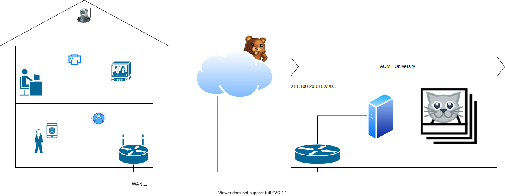
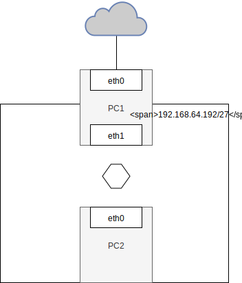
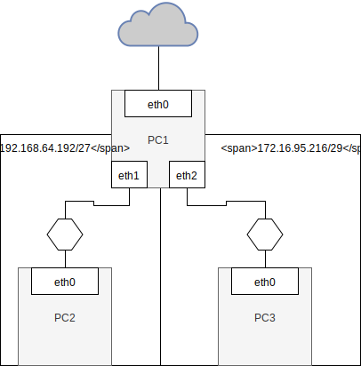

# NAT - Network address translation

## Symulacja

W którym miejscu następuje zmaina adresu prywatnego na publiczny?

## Zadanie

1.
   * Przygotuj konfigurację sieci zgodnie z powyższym diagramem
   * Zweryfikuj poprawność połączenia z siecią internet dla ``PC0``
      * adresacja
      * konfiguracja DHCP (opcjonalna ale wygodna) 
   * W pierwszej kolejności przygotuj ``PC0``, ``PC-1``
   * Upewnij się o poprawnej konfiguracji parametru systemu ``ip_forward`` dla ``PC0``
   * Do konfiguracji wykorzystaj właściwą konfigurację ``VirtualBox`` która pozwoli na dostęp do internetu dla ``PC-1`` za pomocą interfejsu ``eth0``
   * Wykonaj konfigurację translacji adresów tak aby udostępnic komunikację z siecią internet dla ``PC-2``
   * Przygotuj dokumentację powyższego procesu
   *  **czy istnieje różnica jeżeli adres eth0 statyczny/dynamiczny? Jeżeli to jaka?**

1. 
    * Przygotuj konfigurację sieci zgodnie z powyższym diagramem
    * Wykonaj konfigurację translacji adresów tak aby udostępnic komunikację z siecią internet dla ``PC-2`` oraz ``PC-3``
    
2. 
    * Jeżeli konfiguracja była do tej pory statyczna, rozszerz architekturę o automatyczną konfigurację hostów w podsieciach ``192.168.64.192/27`` oraz ``172.16.95.216/29`` z wykorzystaniem usługi ``DHCP``

## Zadanie do domu

1. Zapoznaj się z pojęciem Maskarady IP ``MASQUERADE``
  
## Materiały

* https://tools.ietf.org/html/rfc1918
* https://linux.die.net/man/8/iptables