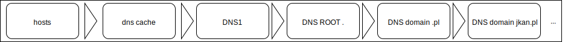
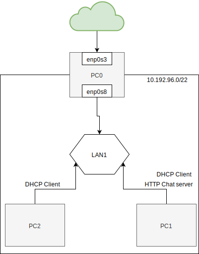

## DNS - Domain name server

  * http://www.thekelleys.org.uk/dnsmasq/doc.html
  * https://www.isc.org/downloads/bind/
  * https://www.iana.org/domains/root/servers
  * https://root-servers.org
  * https://pasja-informatyki.pl/sieci-komputerowe/dns-rodzaje-zapytan/
  
  

## Zadanie

1.
   * Przygotuj konfigurację sieci zgodnie z powyższym diagramem
   * Zweryfikuj poprawność połączenia z siecią internet dla ``PC0``
      * adresacja
   * Skonfiguruj serwer ``DHCP`` dla ``PC0`` tak aby wszystkie nowo przyłączone urządzenia uzyskały właściwą konfigurację ``ip`` 
  

      | klucz    |  wartość   |
      | ------------- |:-------------|  
      |   ``ip``   |   ``10.192.192.0 - 10.192.200.0``  |
      |   ``mask`` |   ``255.255.252.0``                |
      |   ``gateway`` |     ``{wlasciwe ip}``              |
      |   ``dns``  |  ``{wlasciwe ip}``                 |
     
   * Uruchom usługe ``dnsmasq`` dla ``PC0``
   * Skonfiguruj usługę ``DHCP`` tak aby ``PC1`` zawsze uzyskał ten sam adres IP
   * Dokonaj odpowiedniej modyfikacji konfiguracji tak aby z dowolnego komputera w sieci 
   przy komunikacji z adresem ``chat.mydomain.local`` został rozwinięty na adres komputera ``PC1``
   * Uruchom usługę ``http-chat`` na komputerze ``PC1``
   * Przetestuj działanie aplikacji ``http-chat`` z ``PC2`` lub innym nowo podłączonym do sieci
 
   

## Przydatne polecenia

| komenda    |  przykład   | opis  |
| ------------- |:-------------| :---------------| 
|   ``nslookup``    | ``nslookup uek.krakow.pl`` | kwerenda do serwera dns |
|   ``nslookup``    | ``nslookup uek.krakow.pl 8.8.8.8`` | kwerenda do konkretnego serwera dns |
|   ``dig``         | ``dig uek.krakow.pl``      | kwerenda do serwera dns |
|                   |                            | wyczyść lokalny cache dns |   

## extra

Adblock via DNS !!
   * dnsmasq - To juz mamy!
   * bierząca lista trackerów i reklamodawców https://github.com/notracking/hosts-blocklists

## Zadanie do domu

1. Przygotuj system z trybem graficznym, oraz zainstalowanym programem 
``wireshark`` https://www.wireshark.org

