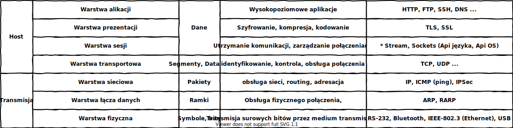
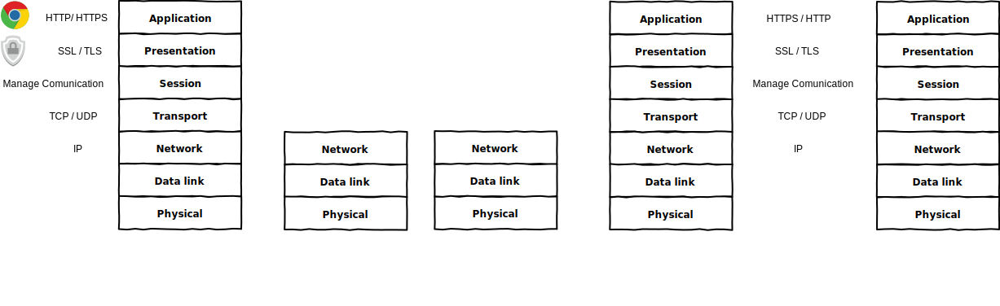

# analiza ruchu sieciowego

  * https://www.tcpdump.org/
  * https://www.wireshark.org/
  * https://wiki.wireshark.org/CaptureFilters

## OSI

  

## Komunikacja

  

## Wartstwa transportowa

  * nawiązanie i obsługa połączeń (sesji) pomiędzy hostami,
  * śledzenie połączeń pomiędzy hostami,
  * podział danych na mniejsze fragmenty,
  * identyfikowanie poszczególnych aplikacji,
  * kontrola przepływu danych,
  * retransmisja w przypadku utraty danych.

## Zadanie 

### TCP vs UDP
1.
   * Przygotuj konfigurację sieci gdzie wykorzystasz 2 komputery. 
     * PC-1 pełniący rolę serwera testowanych usług
     * PC-2 pełniący rolę klienta oraz snifera dla testowanych usług
   * Uruchom PC2 w z wykorzystaniem dystrybucji z interfejsem graficznym
   * Zainstaluj program wireshark dla ``PC2``
   * Wykonaj analizę i zanotuj spostrzerzenia
     * tcp echo server vs udp echo server

### HTTP vs HTTPS
2. 
   * Zainstaluj serwer ``HTTP`` program nginx
   * Przygotuj certyfikat zabezpieczajączy połączenie z serwerem
   * Skonfiguruj możliwość połączenia z wykorzystaniem nowo utworzonych certyfikatów
   * Porównaj komunikacją na różnych warstwach OSI w zależności od wykorzystanego protokołu HTTP vs HTTPS
   
      
